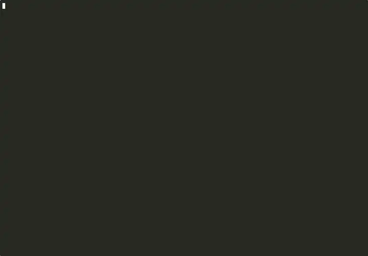

# happyterminals

> **3D world on a teletyper.** Terminal art should feel like magic, not plumbing.

[](https://github.com/lynxnathan/happyterminals/actions/workflows/ci.yml)
[](#license)
[](rust-toolchain.toml)



Spatial composition primitives on the teletyper contract. Fine-grained signal
reactivity (SolidJS-style), a react-three-fiber-shaped scene graph, the
tachyonfx effects pipeline, and z-buffered ASCII 3D — stacked at the
character-cell level. Describe the scene; happyterminals handles projection,
compositing, and ANSI output. Runs on every terminal ever made, from Windows
Terminal to an SSH session into a Raspberry Pi.

## See it

```bash
cargo run --example showcase -p happyterminals
```

The demo above: four 3D models (bunny / cow / teapot / cube), menu-driven
navigation, money particles raining continuously with gravity, live text
input, reveal effects on scene swap, a persistent X/Y/Z axis gizmo. All
pure ASCII + ANSI — no GPU, no OS APIs, no image protocols.

### All examples

| Example | What it shows |
|---------|---------------|
| `showcase` | The hero — everything composed (menu + 3D + particles + text input + effects) |
| `text-reveal` | tachyonfx text effects composed over a live 3D scene |
| `model-viewer` | OBJ mesh loading, orbit/pan/zoom camera, cycle between bunny / cow / teapot |
| `particles` | Pool-based particles with zero per-frame allocations over a rendered mesh |
| `transitions` | Scene A → B named effects (dissolve, slide-left, fade-to-black) with clean owner disposal |
| `json-loader` | Load a scene from JSON via a sandboxed loader — no eval, no arbitrary file I/O, ANSI-stripped |
| `spinning-cube` | ~40 LOC proof-of-stack — signals → 3D → pipeline → terminal |

```bash
cargo run --example <name> -p happyterminals
```

## Why

Terminals have been a teletyping character-stream for fifty years. That
constraint is the point — not the limitation. Every terminal since the VT100
forwards keystrokes and paints glyphs; anything built on that substrate works
everywhere, indefinitely, including over SSH to a bastion host or a Raspberry
Pi. The constraint means stability.

What's been missing from the terminal is **spatial composition**: depth,
transitions, scene graphs, the primitives game engines made normal for UI
decades ago. happyterminals brings them to the character grid — so your CLI
tool, dashboard, or creative piece can *feel* three-dimensional without
stepping outside the teletyper contract.

## Hello world

```rust
use happyterminals::prelude::*;

#[tokio::main(flavor = "current_thread")]
async fn main() -> Result<(), Box<dyn std::error::Error>> {
    let (result, _owner) = create_root(|| {
        let rotation = Signal::new(0.0_f32);
        let writer = rotation.clone();
        let scene = scene()
            .camera(OrbitCamera::default())
            .layer(0, |l| l.cube().rotation(&rotation))
            .build()?;
        Ok::<_, Box<dyn std::error::Error>>((scene, writer))
    });
    let (scene, rotation) = result?;

    run_scene(scene, FrameSpec::default(), |dt, _| {
        rotation.set(rotation.untracked() + dt.as_secs_f32());
    })
    .await
}
```

A spinning cube. ~20 lines. Every terminal.

## Install

Currently pre-crates.io — use as a git dependency:

```toml
[dependencies]
happyterminals = { git = "https://github.com/lynxnathan/happyterminals" }
tokio = { version = "1", features = ["rt", "macros"] }
```

Requires **Rust 1.88+** (pinned via `rust-toolchain.toml`; `rustup`
auto-installs).

v1 release to crates.io is imminent — Phase 3.5 in the roadmap.

## Architecture

A Cargo workspace of seven crates. Most users only touch the meta crate:

```rust
use happyterminals::prelude::*;
```

| Crate | Role |
|-------|------|
| `happyterminals` | Curated public surface — the prelude |
| `happyterminals-core` | Fine-grained reactive signals, grapheme-correct Grid buffer |
| `happyterminals-renderer` | 3D projection, z-buffer rasterization, shading ramp, `Camera` trait |
| `happyterminals-pipeline` | `Effect` trait, `Pipeline` executor, tachyonfx adapter |
| `happyterminals-scene` | Scene IR, scene graph, `TransitionManager` with owner disposal |
| `happyterminals-dsl` | Rust builder DSL + JSON recipe loader + security sandbox |
| `happyterminals-backend-ratatui` | Event loop, `TerminalGuard` RAII, ratatui bridge |
| `happyterminals-input` | Godot/Unreal-style `InputMap`, reactive action signals |

## Design lineage

- **SolidJS** — fine-grained reactivity without a VDOM. Signals are the source
  of truth; redraws are surgical.
- **react-three-fiber** — the declarative scene-graph feel (components as
  nodes, props as state) applied to terminal output.
- **tachyonfx** — the effects foundation. 50+ composable effects built on
  ratatui.
- **voxcii** — ASCII 3D rendering with a dotted shading ramp that keeps unlit
  faces legible.
- **ratatui** — the de-facto Rust TUI framework we render into.

## Compatibility

- **Terminals**: Windows Terminal, GNOME Terminal, macOS Terminal.app, iTerm2,
  Kitty, Alacritty, WezTerm
- **Multiplexers**: tmux, screen (minus some color modes)
- **Remote**: works identically over SSH
- **Baseline**: VT100-compatible terminals render characters but lose color
- **No GPU, no OS APIs, no inline image protocols.** Pure ANSI.

## What ships today

- Reactive core — `Signal` / `Memo` / `Effect` / `Owner` / `batch` / `untracked`
- 3D rendering — z-buffer, reversed-Z, perspective projection, OBJ/STL loading,
  Orbit / FreeLook / FPS cameras
- Particle system — pool-based, zero per-frame allocations
- Color-mode cascade — truecolor → 256 → 16 → mono, `NO_COLOR` aware
- Scene transitions — named effects, clean owner disposal, signal-bindable props
- JSON recipes — schema validation, path sandboxing, ANSI-injection stripping
- Input action system — rebindable mouse + keyboard, reactive action signals
- 449 workspace tests. MSRV 1.88.

Python bindings (PyO3) are the final milestone — the Rust layers are the
engine; Python will be how creative coders reach for it.

## Development

```bash
cargo build --workspace
cargo test --workspace
cargo clippy --workspace --all-targets -- -D warnings
bash scripts/smoke-examples.sh       # compile-check every example
bash scripts/doc-lint-examples.sh    # enforce DEMO-05 header contract
```

## License

Dual-licensed at your option:

- [Apache License, Version 2.0](./LICENSE-APACHE) or
  <https://www.apache.org/licenses/LICENSE-2.0>
- [MIT License](./LICENSE-MIT) or <https://opensource.org/license/mit>

Unless you explicitly state otherwise, any contribution intentionally
submitted for inclusion in the work shall be dual-licensed under the same
terms, without any additional terms or conditions.

---

*3D spatial awareness to teletyping.*
